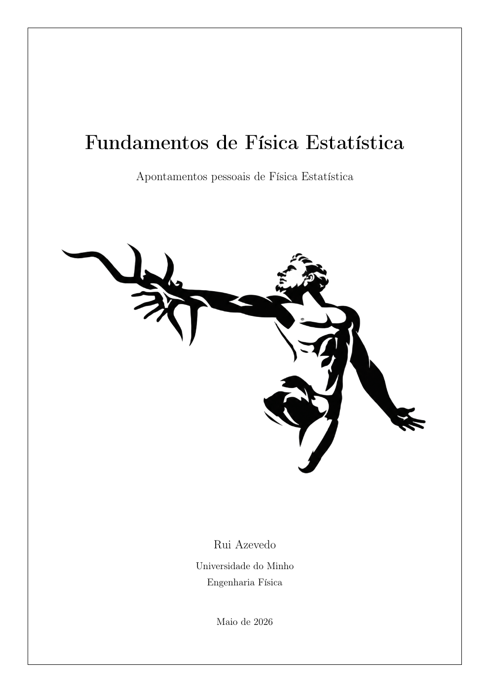

  

<h1 align="center">Fundamentos de Física Estatística</h1>

  Apontamentos pessoais de Física Estatística, por Rui Azevedo

  <a href="Livro/Fundamentos_de_Fisica_Estatistica.pdf"><strong>Ler a versão atual do livro (PDF)</strong></a>

## Sobre o projeto

Este repositório acompanha o desenvolvimento de *Fundamentos de Física
Estatística*, um livro de apontamentos escrito a partir da perspetiva de um
estudante de Engenharia Física da Universidade do Minho.

O livro foi pensado como complemento das aulas, dos apontamentos do professor e
da bibliografia da unidade curricular. Procura apresentar capítulos concisos,
ligados entre si e fáceis de consultar, reconstruindo os passos intermédios que
frequentemente ficam implícitos em exposições mais breves.

A versão atualmente publicada tem **96 páginas** e inclui:

- princípios, postulados e definições da Física Estatística;
- interação de sistemas macroscópicos;
- distribuição canónica de Boltzmann;
- função de partição do gás ideal e paradoxo de Gibbs;
- equipartição da energia e cinética de gases diluídos;
- distribuição grande canónica e potencial químico;
- estatísticas de Fermi-Dirac e Bose-Einstein;
- notas matemáticas complementares.

## Estrutura do repositório

| Caminho | Conteúdo |
|---|---|
| [`Livro/`](Livro/) | PDF mais recente, capa e figuras utilizadas no livro |
| [`Manuscritos/`](Manuscritos/) | Fotografias dos apontamentos originais, organizadas por capítulo e secção |
| [`Arquivo/`](Arquivo/) | Versões anteriores do PDF, material de apoio e rascunhos não utilizados |
| [`HISTORICO_DO_PROJETO.md`](HISTORICO_DO_PROJETO.md) | Principais marcos cronológicos do desenvolvimento |
| [`DECLARACAO_DE_AUTORIA_E_IA.md`](DECLARACAO_DE_AUTORIA_E_IA.md) | Declaração de autoria e descrição do uso de inteligência artificial |
| [`CONTRIBUTING.md`](CONTRIBUTING.md) | Como comunicar erros ou imprecisões |
| [`88/`](88/) | Parte intencional do projeto |

Os nomes originais das fotografias foram preservados. As datas incorporadas
nesses nomes, os manuscritos, as versões sucessivas do PDF e o
[histórico de commits](https://github.com/rui-azevedo-physics/Livro_Apontamentos/commits/main)
documentam o percurso real de
elaboração do livro.

### Nota sobre os primeiros manuscritos

A parte inicial dos manuscritos está incompleta porque, quando estes apontamentos
começaram a ser escritos, a intenção era apenas preparar um teste, e não criar
um livro. Ao longo do trabalho, ganhei gosto pelo processo e reconheci o seu
potencial: tanto para lapidar detalhes das explicações como para identificar os
pontos cruciais em que outros alunos poderiam ter dúvidas. Foi dessa mudança de
propósito que nasceu a ideia de transformar os apontamentos num livro que pudesse
constituir uma mais-valia para outros estudantes.

## Código LaTeX

A fonte LaTeX não é disponibilizada publicamente. O repositório permite consultar
a versão compilada em PDF, os manuscritos originais e o histórico de
desenvolvimento, mas não contém o ficheiro-fonte editável do livro.

## Autoria e uso de inteligência artificial

A seleção e organização dos conteúdos, o raciocínio, as explicações, os
manuscritos e as decisões sobre o texto final são da autoria de Rui Azevedo.
Ferramentas de inteligência artificial foram utilizadas como apoio
instrumental, nomeadamente na geração de algumas figuras, na transcrição de
manuscritos para LaTeX, na revisão linguística e como instrumento de consulta
durante o estudo.

A descrição completa encontra-se na
[`DECLARACAO_DE_AUTORIA_E_IA.md`](DECLARACAO_DE_AUTORIA_E_IA.md).

## Correções

Erros e imprecisões podem ser comunicados através de
[ruiazevedo18210@gmail.com](mailto:ruiazevedo18210@gmail.com?subject=F%C3%ADsica%20Estat%C3%ADstica),
com o assunto **Física Estatística**. Sempre que possível, indica a página, a
secção e a passagem em causa.

## Licença

O livro é disponibilizado gratuitamente sob a licença
[Creative Commons Atribuição-NãoComercial-SemDerivações 4.0 Internacional](LICENSE.md).
É permitida a cópia e partilha da obra inalterada, com atribuição ao autor e
sem fins comerciais.

© 2026 Rui Azevedo
